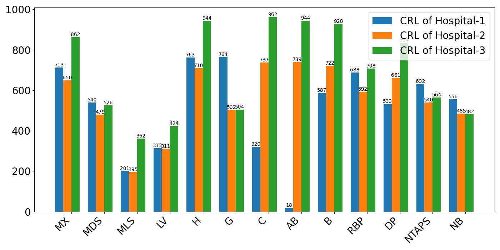
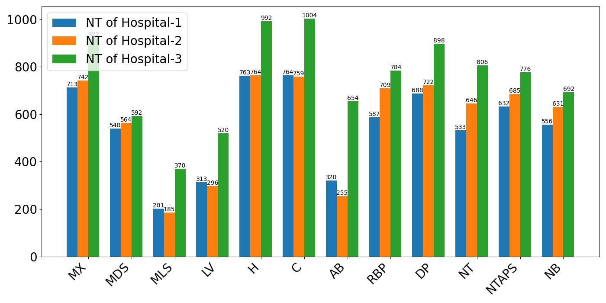

<div align="center">

# FUSEP: A Multi-Center Benchmark for Diverse Tasks in Fetal Ultrasound Screening Early Pregnancy

**[KDD 2026 Datasets and Benchmarks Track]**

[](https://dl.acm.org/doi/XXXXXX)
[](LICENSE)
[](https://www.python.org/)
[](https://pytorch.org/)

</div>

---

## 📋 Table of Contents

- [Introduction](#introduction)
- [Dataset Overview](#dataset-overview)
  - [Dataset Statistics](#dataset-statistics)
  - [Anatomical Structures](#anatomical-structures)
  - [Hospital Centers](#hospital-centers)
- [Benchmark Tasks](#benchmark-tasks)
- [Repository Structure](#repository-structure)
- [Installation](#installation)
- [Dataset Download](#dataset-download)
- [Model Zoo & Pretrained Weights](#model-zoo--pretrained-weights)
  - [Fully Supervised Detection](#-fully-supervised-detection)
  - [Semi-Supervised Detection](#-semi-supervised-detection)
  - [Unsupervised Domain Adaptation (UDA)](#-unsupervised-domain-adaptation-uda)
  - [Source-Free Domain Adaptation (SFDA)](#-source-free-domain-adaptation-sfda)
- [Quick Start](#quick-start)
- [Citation](#citation)
- [License](#license)
- [Acknowledgements](#acknowledgements)

---

## Introduction

FUSEP is the **first open-source multi-center ultrasound benchmark** dataset for early fetal pregnancy screening, accepted at **KDD 2026 Datasets and Benchmarks Track**.

A large number of infants with congenital anomalies are born each year globally, especially in areas with underdeveloped medical resources. Fetal ultrasound screening is the most common modality for early pregnancy anatomy detection, capable of detecting anomalies early and providing opportune treatment advice. However, the **lack of publicly available ultrasound datasets** on early fetal gestation has significantly slowed down the development of automated assisted diagnosis.

**FUSEP** addresses this gap by providing:
- 🏥 **Multi-center data** from **3 hospitals** with different ultrasound devices
- 🖼️ **4,017 ultrasound images** across two standard views (CRL and NT)
- 📦 **45,820 expert-level box annotations** covering 14 key anatomical structures
- 🔬 **Comprehensive benchmarks** across 4 learning paradigms

<div align="center">
  
  &nbsp;&nbsp;
  
  <br>
  <em>Left: Crown-Rump Length (CRL) View &nbsp;&nbsp; Right: Nuchal Translucency (NT) View</em>
</div>

---

## Dataset Overview

### Dataset Statistics

| Split | Hospital | Device | Images | Box Annotations |
|-------|----------|--------|--------|----------------|
| Train/Val/Test | Hospital-1 (Shenzhen) | SAMSUNG | 1,532 | 13,485 |
| Train/Val/Test | Hospital-2 (Chengdu)  | Sonoscape | 1,496 | 14,281 |
| Train/Val/Test | Hospital-3 (Kunming)  | GE | 989 | 18,054 |
| **Total** | **3 Hospitals** | **3 Devices** | **4,017** | **45,820** |

> All data was collected from pregnant women at 11–14 gestational weeks. The multi-device setup introduces realistic domain shifts critical for evaluating and improving model robustness.

### Anatomical Structures

FUSEP annotates **14 key anatomical structures** across two standard views:

<table>
<thead>
<tr>
<th colspan="2">CRL View (13 structures)</th>
<th colspan="2">NT View (13 structures)</th>
</tr>
<tr>
<th>Structure</th><th>Abbr.</th>
<th>Structure</th><th>Abbr.</th>
</tr>
</thead>
<tbody>
<tr><td>Maxilla</td><td>MX</td><td>Maxilla</td><td>MX</td></tr>
<tr><td>Mandible with a Dot Shape</td><td>MDS</td><td>Mandible with a Dot Shape</td><td>MDS</td></tr>
<tr><td>Mandible with Long Strip</td><td>MLS</td><td>Mandible with Long Strip</td><td>MLS</td></tr>
<tr><td>Lateral Ventricle</td><td>LV</td><td>Lateral Ventricle</td><td>LV</td></tr>
<tr><td>Head</td><td>H</td><td>Head</td><td>H</td></tr>
<tr><td>Genitals</td><td>G</td><td>Chest</td><td>C</td></tr>
<tr><td>Chest</td><td>C</td><td>ABdomen</td><td>AB</td></tr>
<tr><td>ABdomen</td><td>AB</td><td>RhomBencePhalon</td><td>RBP</td></tr>
<tr><td>Breech</td><td>B</td><td>DiencePhalon</td><td>DP</td></tr>
<tr><td>RhomBencePhalon</td><td>RBP</td><td>Nuchal Translucency</td><td>NT</td></tr>
<tr><td>DiencePhalon</td><td>DP</td><td>Nasal Tip And Prenasal Skin</td><td>NTAPS</td></tr>
<tr><td>Nasal Tip And Prenasal Skin</td><td>NTAPS</td><td>Nasal Bone</td><td>NB</td></tr>
<tr><td>Nasal Bone</td><td>NB</td><td>—</td><td>—</td></tr>
</tbody>
</table>

### Hospital Centers

| Hospital | Location | Device | Abbreviation |
|----------|----------|--------|-------------|
| Hospital-1 | Shenzhen Maternity and Child Healthcare Hospital | SAMSUNG | SZ |
| Hospital-2 | Sichuan Provincial Maternity and Child Health Care Hospital | Sonoscape | SC |
| Hospital-3 | Yunnan Maternal and Child Health Hospital | GE | YN |

---

## Benchmark Tasks

FUSEP provides benchmarks across **four learning paradigms**:

| Task | Setting | Description | Code |
|------|---------|-------------|------|
| **Fully Supervised** | 100% labeled data | Multi-object detection with full annotations | [`FullSupervise/`](FullSupervise/) |
| **Semi-Supervised** | 5% / 10% labeled | Leverages unlabeled data within the same hospital | [`Semi/`](Semi/) |
| **Unsupervised Domain Adaptation (UDA)** | Cross-hospital | Source-labeled, target-unlabeled adaptation | [`UDA/`](UDA/) |
| **Source-Free Domain Adaptation (SFDA)** | Cross-hospital | Only source model accessible, no source data | [`SF_AT/`](SF_AT/) |

---

## Repository Structure

```
FUSEP/
├── FullSupervise/          # Fully supervised detection (Relation-DETR based)
│   ├── configs/            # Model configuration files
│   ├── models/             # Model architecture implementations
│   ├── datasets/           # Dataset loading utilities
│   ├── transforms/         # Data augmentation transforms
│   ├── tools/              # Training/evaluation tools
│   ├── checkpoints/        # Pretrained model weights
│   ├── visualization/      # Visualization utilities & results
│   ├── main.py             # Main training entry point
│   ├── test.py             # Evaluation script
│   ├── inference.py        # Inference script
│   └── requirements.txt    # Dependencies
│
├── Semi/                   # Semi-supervised detection (MMDetection based)
│   ├── configs/            # Semi-supervised config files
│   ├── mmdet_extension/    # MMDetection extensions
│   ├── mmdetection/        # MMDetection core
│   ├── pretrained_model/   # Backbone pretrained weights
│   ├── tools/              # Training & evaluation scripts
│   ├── work_dirs/          # Experiment outputs & checkpoints
│   └── requirements.txt    # Dependencies
│
├── UDA/                    # Unsupervised Domain Adaptation
│   ├── model/              # UDA model implementations
│   ├── data/               # Data pipeline
│   ├── utils/              # Utility functions
│   ├── train.py            # UDA training script
│   └── test.py             # UDA evaluation script
│
├── SF_AT/                  # Source-Free Domain Adaptation (AT-based)
│   ├── adapteacher/        # Adaptive Teacher framework
│   ├── configs/            # YAML config files for all domain pairs
│   ├── output/             # Experiment outputs
│   │   ├── CRL/            # CRL view domain adaptation results
│   │   └── NT/             # NT view domain adaptation results
│   └── train_net.py        # Training entry point
│
├── Datasets_Encrypted/     # Encrypted dataset storage
├── SCSZ/                   # Hospital cross-domain image data
├── CRL.jpg                 # CRL view example
├── NT.jpg                  # NT view example
└── README.md               # This file
```

---

## Installation

### Prerequisites

- Python >= 3.6
- CUDA >= 10.2 (GPU recommended)
- PyTorch >= 1.6

### 1. Clone the Repository

```bash
git clone https://github.com/YOUR_USERNAME/FUSEP.git
cd FUSEP
```

### 2. Setup by Task

<details>
<summary><b>Fully Supervised Detection</b></summary>

```bash
cd FullSupervise
pip install -r requirements.txt

# Install PyTorch (adjust CUDA version as needed)
conda install pytorch==1.12.1 torchvision==0.13.1 torchaudio==0.12.1 cudatoolkit=11.3 -c pytorch
```
</details>

<details>
<summary><b>Semi-Supervised Detection</b></summary>

```bash
cd Semi
pip install -r requirements.txt

# MMDetection setup
# Python >= 3.6, PyTorch == 1.6.0, mmdet == 2.10.0
pip install mmdet==2.10.0
```

Download the ResNet-50 pretrained backbone:
```bash
wget https://download.pytorch.org/models/resnet50-19c8e357.pth -P pretrained_model/backbone/
```
</details>

<details>
<summary><b>Unsupervised Domain Adaptation (UDA)</b></summary>

```bash
cd UDA
pip install -r requirements.txt
```
</details>

<details>
<summary><b>Source-Free Domain Adaptation (SF-AT)</b></summary>

```bash
cd SF_AT
# Requires Detectron2
pip install detectron2 -f https://dl.fbaipublicfiles.com/detectron2/wheels/cu113/torch1.9/index.html
```
</details>

---

## Dataset Download

The FUSEP dataset is available at:

| Resource | Link |
|----------|------|
| 📦 Full Dataset (COCO format) | [Google Drive](https://drive.google.com/YOUR_LINK_HERE) |
| 📝 Annotation Files only | [Google Drive](https://drive.google.com/YOUR_LINK_HERE) |
| 🗂️ Domain Adaptation Splits | [Google Drive](https://drive.google.com/YOUR_LINK_HERE) |

### Dataset Structure

After downloading, organize the data as follows:

```
data/
├── FUSEP/
│   ├── Hospital1_SZ/
│   │   ├── images/
│   │   │   ├── CRL/
│   │   │   └── NT/
│   │   └── annotations/
│   │       ├── train.json
│   │       ├── val.json
│   │       └── test.json
│   ├── Hospital2_SC/
│   │   ├── images/
│   │   └── annotations/
│   └── Hospital3_YN/
│       ├── images/
│       └── annotations/
```

---

## Model Zoo & Pretrained Weights

All pretrained weights are organized in the `FUSEP_weights/` folder. Upload to Google Drive and replace the links below.

**Naming convention:**
- Fully Supervised: `RelationDETR_{Hospital}_{View}_best_ap.pth`
- Semi-Supervised: `UnbiasedTeacher_{Hospital}_{View}_{Ratio}_latest.pth`
- SFDA: `AdaptiveTeacher_{View}_{Source}2{Target}_model_final.pth`

Hospital abbreviations: **SZ** = Hospital-1 (Shenzhen), **SC** = Hospital-2 (Sichuan), **YN** = Hospital-3 (Yunnan)

---

### 🔵 Fully Supervised Detection

Trained with **Relation-DETR** (ResNet-50 backbone). Two checkpoints per experiment: `best_ap` (best mAP) and `best_ap50` (best mAP@50).

> Results from paper (Table 3) are reported as `mAP H1 / H2 / H3`.

#### CRL View

| Hospital | Checkpoint (best_ap) | Checkpoint (best_ap50) | mAP (paper) |
|----------|---------------------|----------------------|-------------|
| Hospital-1 (SZ) | [RelationDETR_SZ_CRL_best_ap.pth](https://drive.google.com/YOUR_LINK) | [RelationDETR_SZ_CRL_best_ap50.pth](https://drive.google.com/YOUR_LINK) | 96.3 |
| Hospital-2 (SC) | [RelationDETR_SC_CRL_best_ap.pth](https://drive.google.com/YOUR_LINK) | [RelationDETR_SC_CRL_best_ap50.pth](https://drive.google.com/YOUR_LINK) | 93.7 |
| Hospital-3 (YN) | [RelationDETR_YN_CRL_best_ap.pth](https://drive.google.com/YOUR_LINK) | [RelationDETR_YN_CRL_best_ap50.pth](https://drive.google.com/YOUR_LINK) | 85.6 |

#### NT View

| Hospital | Checkpoint (best_ap) | Checkpoint (best_ap50) | mAP (paper) |
|----------|---------------------|----------------------|-------------|
| Hospital-1 (SZ) | [RelationDETR_SZ_NT_best_ap.pth](https://drive.google.com/YOUR_LINK) | [RelationDETR_SZ_NT_best_ap50.pth](https://drive.google.com/YOUR_LINK) | 96.0 |
| Hospital-2 (SC) | [RelationDETR_SC_NT_best_ap.pth](https://drive.google.com/YOUR_LINK) | [RelationDETR_SC_NT_best_ap50.pth](https://drive.google.com/YOUR_LINK) | 93.9 |
| Hospital-3 (YN) | [RelationDETR_YN_NT_best_ap.pth](https://drive.google.com/YOUR_LINK) | [RelationDETR_YN_NT_best_ap50.pth](https://drive.google.com/YOUR_LINK) | 90.6 |

> Other methods in Table 3 (Faster-RCNN, DETR, YOLOX, Deformable-DETR, ViTDet, CO-DETR, DINO, DDQ) use publicly available pretrained weights. Please refer to their official repositories for downloads.

<details>
<summary>Training Command for Fully Supervised</summary>

```bash
cd FullSupervise

# Train on Hospital-2 (SC), CRL view
CUDA_VISIBLE_DEVICES=0 accelerate launch main.py \
  --config configs/train_config_det_SC_CRL.py

# Evaluate
CUDA_VISIBLE_DEVICES=0 accelerate launch test.py \
  --model-config configs/relation_detr/relation_detr_resnet50_800_1333.py \
  --checkpoint checkpoints/.../best_ap.pth
```
</details>

---

### 🟢 Semi-Supervised Detection

Benchmarked with **Unbiased Teacher** on CRL view under 5% and 10% labeled data ratios.

> Supported SSOD methods: STAC, Unbiased Teacher, Soft Teacher, LabelMatch, Sparse Semi-DETR

#### CRL View — 10% Labeled Data

| Hospital | Method | Checkpoint |
|----------|--------|------------|
| Hospital-2 (SC) | Unbiased Teacher | [UnbiasedTeacher_SC_CRL_10pct_v1_latest.pth](https://drive.google.com/YOUR_LINK) |
| Hospital-1 (SZ) | Unbiased Teacher | [UnbiasedTeacher_SZ_CRL_10pct_latest.pth](https://drive.google.com/YOUR_LINK) |
| Hospital-3 (YN) | Unbiased Teacher | [UnbiasedTeacher_YN_CRL_10pct_latest.pth](https://drive.google.com/YOUR_LINK) |

#### CRL View — 5% Labeled Data

| Hospital | Method | Checkpoint |
|----------|--------|------------|
| Hospital-2 (SC) | Unbiased Teacher | [UnbiasedTeacher_SC_CRL_5pct_latest.pth](https://drive.google.com/YOUR_LINK) |

<details>
<summary>Training Commands for Semi-Supervised</summary>

```bash
cd Semi

# Step 1: Train baseline with labeled data only
cd examples/train/xonsh
xonsh train_gpu2.sh ./configs/baseline/baseline_ssod.py 1 1 coco-standard

# Step 2: Semi-supervised training with labeled + unlabeled data
xonsh train_gpu8.sh ./configs/labelmatch/labelmatch_standard.py 1 1 none

# Evaluation
cd examples/eval
xonsh eval.sh
```
</details>

---

### 🟡 Unsupervised Domain Adaptation (UDA)

Cross-hospital domain adaptation without target labels.

> UDA weights correspond to models trained in the `UDA/` module. Checkpoints to be uploaded after Google Drive setup.

#### CRL View

| Source → Target | Checkpoint |
|----------------|------------|
| SC → SZ | [Coming soon](https://drive.google.com/YOUR_LINK) |
| SC → YN | [Coming soon](https://drive.google.com/YOUR_LINK) |
| SZ → SC | [Coming soon](https://drive.google.com/YOUR_LINK) |
| SZ → YN | [Coming soon](https://drive.google.com/YOUR_LINK) |
| YN → SC | [Coming soon](https://drive.google.com/YOUR_LINK) |
| YN → SZ | [Coming soon](https://drive.google.com/YOUR_LINK) |

#### NT View

| Source → Target | Checkpoint |
|----------------|------------|
| SC → SZ | [Coming soon](https://drive.google.com/YOUR_LINK) |
| SC → YN | [Coming soon](https://drive.google.com/YOUR_LINK) |
| SZ → SC | [Coming soon](https://drive.google.com/YOUR_LINK) |
| SZ → YN | [Coming soon](https://drive.google.com/YOUR_LINK) |
| YN → SC | [Coming soon](https://drive.google.com/YOUR_LINK) |
| YN → SZ | [Coming soon](https://drive.google.com/YOUR_LINK) |

<details>
<summary>Training Commands for UDA</summary>

```bash
cd UDA

# Train UDA model (source: SZ, target: SC)
python train.py --source SZ --target SC --view CRL

# Evaluate
python test.py --config test.json --checkpoint /path/to/checkpoint.pth
```
</details>

---

### 🔴 Source-Free Domain Adaptation (SFDA)

Based on **Cross-Domain Adaptive Teacher**. Only source model parameters accessible — no source data required at adaptation time. Final checkpoint `model_final.pth` provided for all 12 domain pairs (6 CRL + 6 NT).

#### CRL View

| Source → Target | Checkpoint |
|----------------|------------|
| SC → SZ | [AdaptiveTeacher_CRL_SC2SZ_model_final.pth](https://drive.google.com/YOUR_LINK) |
| SC → YN | [AdaptiveTeacher_CRL_SC2YN_model_final.pth](https://drive.google.com/YOUR_LINK) |
| SZ → SC | [AdaptiveTeacher_CRL_SZ2SC_model_final.pth](https://drive.google.com/YOUR_LINK) |
| SZ → YN | [AdaptiveTeacher_CRL_SZ2YN_model_final.pth](https://drive.google.com/YOUR_LINK) |
| YN → SC | [AdaptiveTeacher_CRL_YN2SC_model_final.pth](https://drive.google.com/YOUR_LINK) |
| YN → SZ | [AdaptiveTeacher_CRL_YN2SZ_model_final.pth](https://drive.google.com/YOUR_LINK) |

#### NT View

| Source → Target | Checkpoint |
|----------------|------------|
| SC → SZ | [AdaptiveTeacher_NT_SC2SZ_model_final.pth](https://drive.google.com/YOUR_LINK) |
| SC → YN | [AdaptiveTeacher_NT_SC2YN_model_final.pth](https://drive.google.com/YOUR_LINK) |
| SZ → SC | [AdaptiveTeacher_NT_SZ2SC_model_final.pth](https://drive.google.com/YOUR_LINK) |
| SZ → YN | [AdaptiveTeacher_NT_SZ2YN_model_final.pth](https://drive.google.com/YOUR_LINK) |
| YN → SC | [AdaptiveTeacher_NT_YN2SC_model_final.pth](https://drive.google.com/YOUR_LINK) |
| YN → SZ | [AdaptiveTeacher_NT_YN2SZ_model_final.pth](https://drive.google.com/YOUR_LINK) |

<details>
<summary>Training Commands for SFDA</summary>

```bash
cd SF_AT

# Train source-free adaptive teacher (CRL: SC → SZ)
python train_net.py \
  --num-gpus 4 \
  --config configs/CRL_SC2SZ.yaml \
  OUTPUT_DIR output/CRL/CRL_SC2SZ

# Evaluate
python train_net.py \
  --eval-only \
  --num-gpus 4 \
  --config configs/CRL_SC2SZ.yaml \
  MODEL.WEIGHTS output/CRL/CRL_SC2SZ/model_final.pth
```
</details>

---

## Quick Start

### Inference with Pretrained Weights

```python
# Fully supervised inference example
cd FullSupervise

python inference.py \
  --model-config configs/relation_detr/relation_detr_resnet50_800_1333.py \
  --checkpoint /path/to/checkpoint.pth \
  --image /path/to/ultrasound_image.jpg \
  --show-result
```

### Training from Scratch

```bash
# Fully supervised training (single GPU)
cd FullSupervise
CUDA_VISIBLE_DEVICES=0 accelerate launch main.py

# Multi-GPU training
CUDA_VISIBLE_DEVICES=0,1,2,3 accelerate launch main.py
```

### Evaluation

```bash
cd FullSupervise

# Evaluate on a specific hospital
CUDA_VISIBLE_DEVICES=0 accelerate launch test.py \
  --data-path /path/to/FUSEP/Hospital1_SZ \
  --model-config configs/relation_detr/relation_detr_resnet50_800_1333.py \
  --checkpoint /path/to/checkpoint.pth
```

---

## Citation

If you find FUSEP useful for your research, please consider citing our paper:

```bibtex
@inproceedings{pu2026fusep,
  title     = {FUSEP: A Multi-Center Benchmark for Diverse Tasks in Fetal Ultrasound Screening Early Pregnancy},
  author    = {Pu, Bin and Yang, Jiwen and Wang, Liwen and Tan, Ying and He, Guannan and Dong, Xingbo and Lin, Qika and Guo, Jiarong and Yang, Lixian and Li, Shengli and Liu, Zuozhu and Li, Kenli},
  booktitle = {Proceedings of the 32st ACM SIGKDD Conference on Knowledge Discovery and Data Mining (KDD)},
  year      = {2026},
  publisher = {ACM}
}
```

This repository also builds upon the following works:

```bibtex
@inproceedings{hou2024relation,
  title     = {Relation DETR: Exploring Explicit Position Relation Prior for Object Detection},
  author    = {Hou, Xiuquan and Liu, Meiqin and Zhang, Senlin and Wei, Ping and Chen, Badong and Lan, Xuguang},
  booktitle = {European Conference on Computer Vision (ECCV)},
  year      = {2024}
}

@inproceedings{li2022cross,
  title     = {Cross-Domain Adaptive Teacher for Object Detection},
  author    = {Li, Yu-Jhe and Dai, Xiaoliang and Ma, Chih-Yao and Liu, Yen-Cheng and Chen, Kan and Wu, Bichen and He, Zijian and Kitani, Kris and Vajda, Peter},
  booktitle = {IEEE Conference on Computer Vision and Pattern Recognition (CVPR)},
  year      = {2022}
}

@inproceedings{Chen2022LabelMatching,
  title     = {Label Matching Semi-Supervised Object Detection},
  author    = {Chen, Binbin and Chen, Weijie and Yang, Shicai and Xuan, Yunyi and Song, Jie and Xie, Di and Pu, Shiliang and Song, Mingli and Zhuang, Yueting},
  booktitle = {IEEE/CVF Conference on Computer Vision and Pattern Recognition (CVPR)},
  year      = {2022}
}
```

---

## License

This project is released under the [Apache 2.0 License](LICENSE).

The dataset is provided for **research purposes only**. All clinical data was collected under appropriate ethical approvals from the participating hospitals.

---

## Acknowledgements

This work was supported by the participating hospitals:
- **Shenzhen Maternity and Child Healthcare Hospital**, Shenzhen, China
- **Sichuan Provincial Maternity and Child Health Care Hospital**, Chengdu, China  
- **Yunnan Maternal and Child Health Hospital**, Kunming, China

This codebase builds upon excellent open-source projects:
- [Relation-DETR](https://github.com/xiuqhou/Relation-DETR) — Fully supervised detection backbone
- [LabelMatch / MMDetection](https://github.com/hikvision-research/SSOD) — Semi-supervised detection framework
- [Adaptive Teacher](https://github.com/facebookresearch/adaptive_teacher) — Source-free domain adaptation

---

<div align="center">
  <b>⭐ If FUSEP is helpful to your research, please star this repository!</b>
</div>
